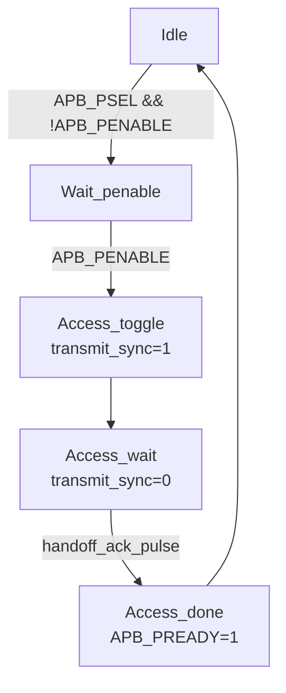
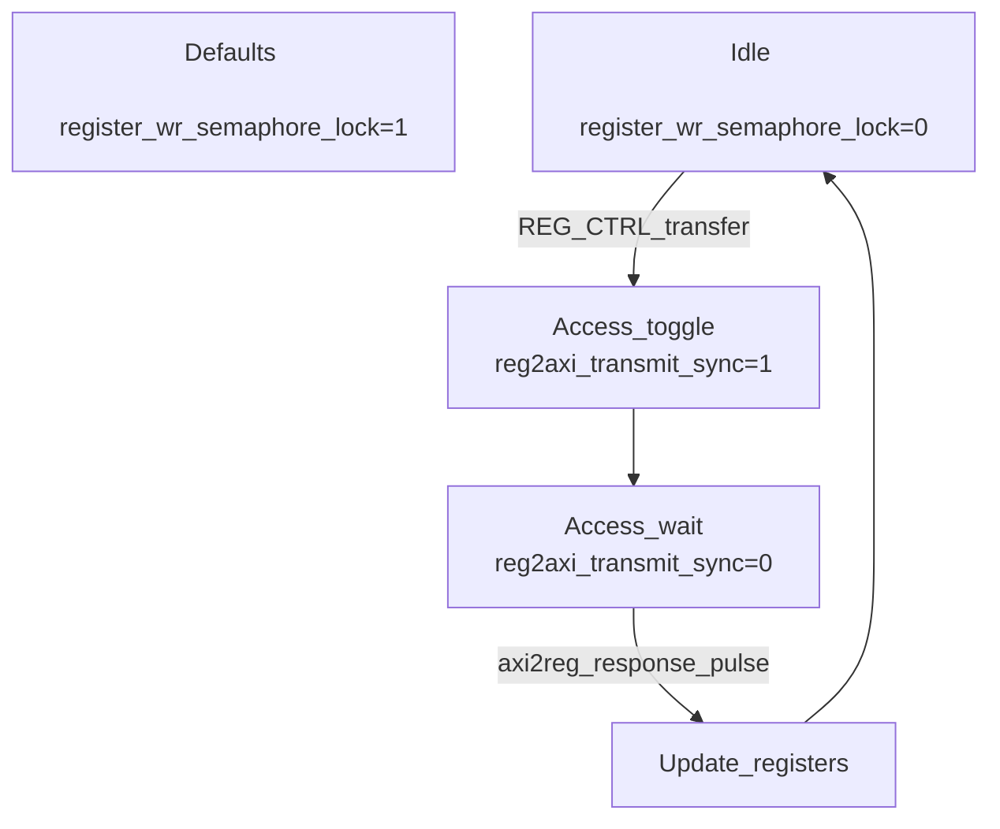
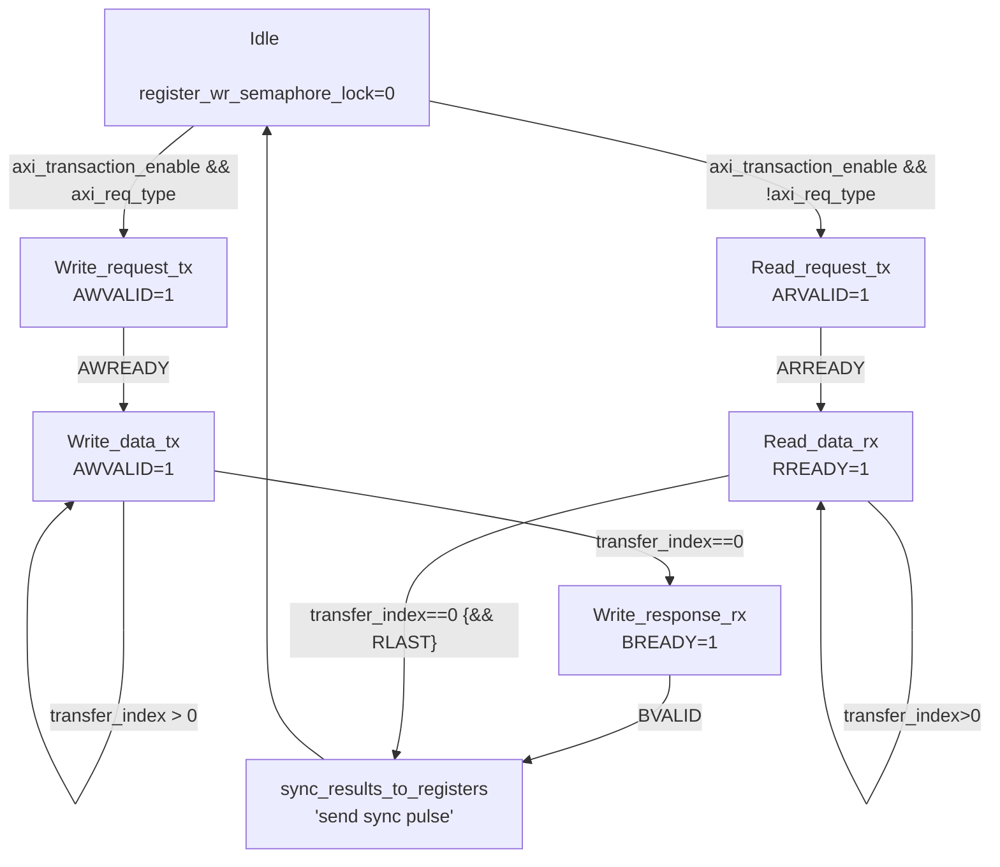

PIO Proxy Diagram (WIP)

APB Domain FSM

```mermaid
flowchart TD
    classDef default text-align:center
    %%class idle,setup,access_toggle,access_wait,access_done cState

    idle[Idle]
    wait_penable[Wait_penable \n]
    transmit_toggle[Access_toggle \n transmit_sync=1]
    access_wait[Access_wait \n transmit_sync=0]
    access_done[Access_done \n APB_PREADY=1]

    idle --> |"APB_PSEL && !APB_PENABLE"| wait_penable
    wait_penable --> |APB_PENABLE| transmit_toggle
    transmit_toggle --> access_wait
    access_wait --> |handoff_ack_pulse| access_done
    access_done --> idle
```

Register Domain FSM

```mermaid
flowchart TD
    classDef default text-align:center
    %%class idle,setup,access_toggle,access_wait,access_done cState

    default[Defaults \n register_wr_semaphore_lock=1]

    idle[Idle \n register_wr_semaphore_lock=0]
    transmit_toggle[Access_toggle \n reg2axi_transmit_sync=1]
    access_wait[Access_wait \n reg2axi_transmit_sync=0]
    update_registers[Update_registers]

    idle --> |"REG_CTRL_transfer"| transmit_toggle
    transmit_toggle --> access_wait
    access_wait --> |axi2reg_response_pulse| update_registers
    update_registers --> idle
```

AXI Domain FSM

```mermaid
flowchart TD
    classDef default text-align:center
    %%class idle,setup,access_toggle,access_wait,access_done cState

    idle[Idle \n register_wr_semaphore_lock=0]

    write_request_tx[Write_request_tx \n AWVALID=1]
    write_data_tx[Write_data_tx \n AWVALID=1 \n]
    write_response_rx[Write_response_rx \n BREADY=1]
    update_registers[sync_results_to_registers \n 'send sync pulse']

    read_request_tx[Read_request_tx \n ARVALID=1]
    read_data_rx[Read_data_rx \n RREADY=1]

    idle --> |"axi_transaction_enable && axi_req_type"| write_request_tx
    write_request_tx --> |AWREADY| write_data_tx
    write_data_tx --> |"transfer_index==0 "| write_response_rx
    write_data_tx --> |"transfer_index > 0"| write_data_tx
    write_response_rx --> |BVALID| update_registers
    update_registers --> idle

    idle --> |"axi_transaction_enable && !axi_req_type"| read_request_tx
    read_request_tx --> |"ARREADY"| read_data_rx
    read_data_rx --> |"transfer_index>0 "| read_data_rx
    read_data_rx --> |"transfer_index==0 {&& RLAST}"| update_registers
```