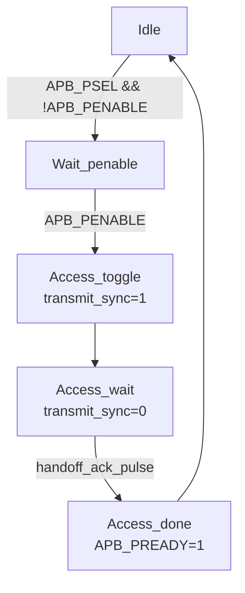

PIO Proxy Diagram (WIP)

APB FSM

```mermaid
flowchart TD
    classDef default text-align:center
    %%class idle,setup,access_toggle,access_wait,access_done cState

    idle[Idle]
    wait_penable[Wait_penable \n]
    transmit_toggle[Access_toggle \n transmit_sync=1]
    access_wait[Access_wait \n transmit_sync=0]
    access_done[Access_done \n APB_PREADY=1]

    idle --> |"APB_PSEL && !APB_PENABLE"| wait_penable
    wait_penable --> |APB_PENABLE| transmit_toggle
    transmit_toggle --> access_wait
    access_wait --> |handoff_ack_pulse| access_done
    access_done --> idle
```